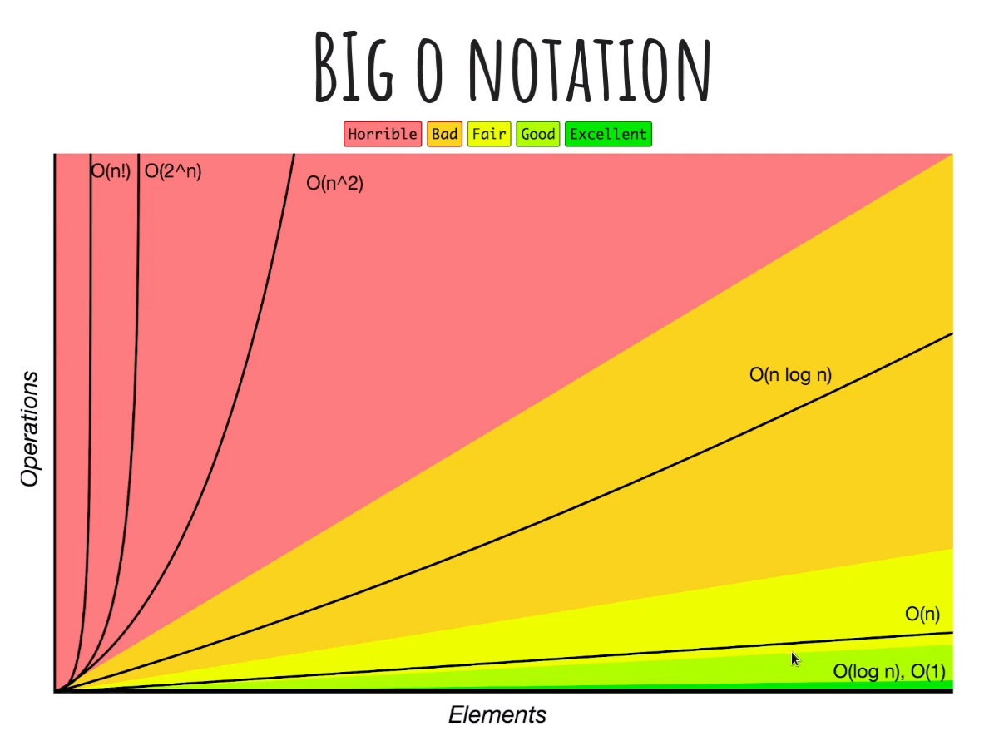
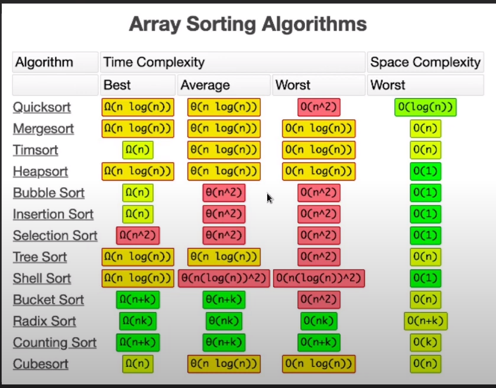

# Anotações dos estudos sobre estrutura de dados e algoritmos

- Eficiência diz respeito a quantidade de gastos para realizar determinada tarefa.
- Complexidade diz respeito a o quão difícil é o processo de realização de determinada tarefa.

## Big O Notation

- É um modo de classificar o algoritmo pelo seu tempo de execução ou espaço ocupado conforme o nosso input aumenta

O `n` representa os dados, na Big O notation o que temos é uma função de `n`.

